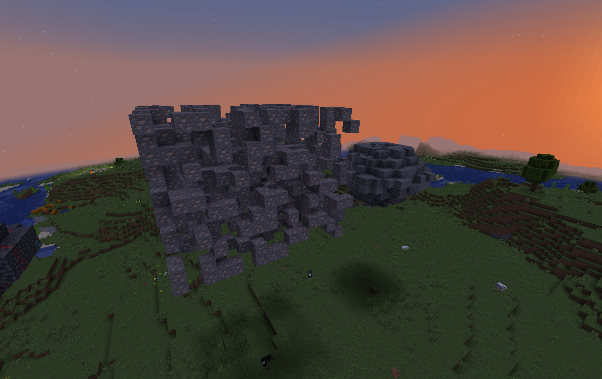
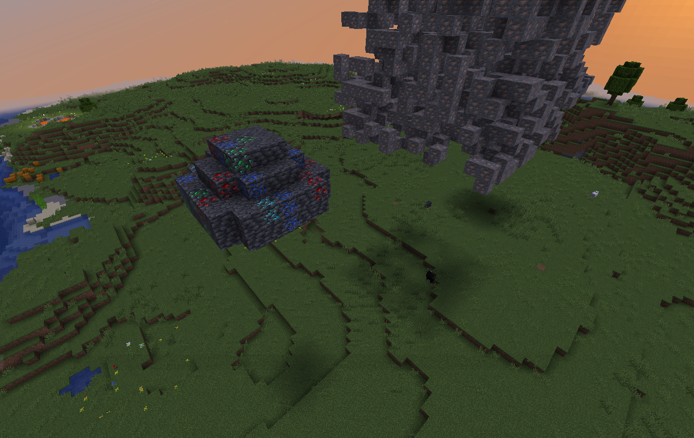
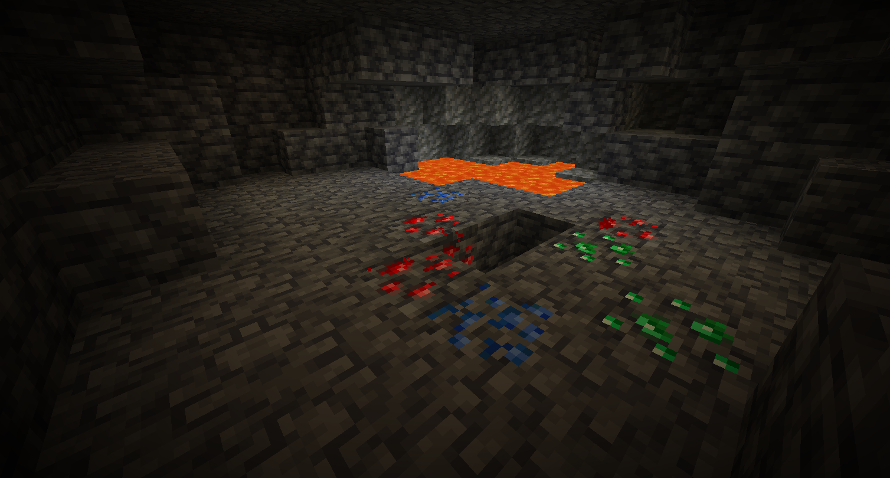
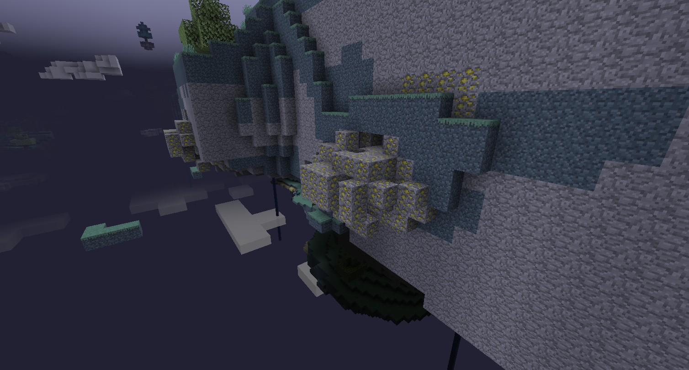
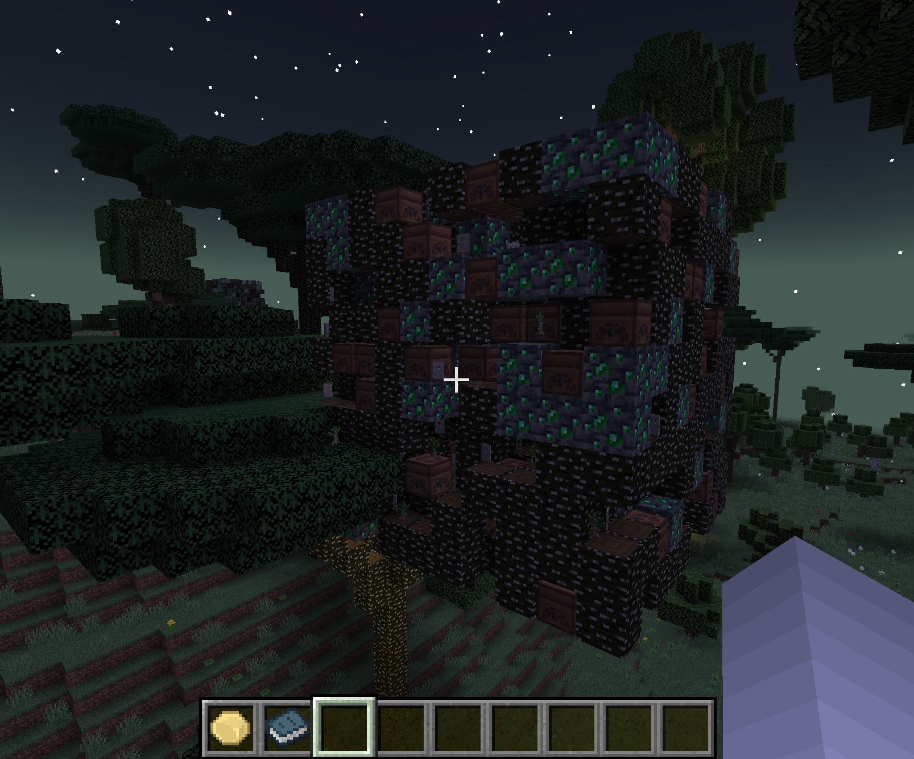

# HB’s Ore Clusters and Regen

## Short Overview

**HB’s Ore Clusters and Regen** is a mod that spawns large clusters of ore in the world in addition to the small vanilla ore veins players are used to. These ore clusters also regenerate (configurable) after several days so the clusters can be harvested again, boosting resource supply and incentivizing the player to set up multiple small bases around the world, and interconnect them.

## Why would you want this?

<ul>
  <li>Finding a large "cluster" of ore is a rewarding discovery that makes exploring caves more fun</li>
  <li>If you think Gregtech Ore Generation style is cool and you also don’t want to lose the traditional vanilla ore veins</li>
  <li>Regenerating clusters incentivize players to create a true secondary mining base, and makes choosing the location of a base more important</li>
</ul>

## Which ores regenerate? How big are the clusters? What if I like normal Minecraft mining?

- This mod does not modify the existing vanilla ore generation at all—it finds an existing ore vein and creates a cluster out of it.
- Vanilla mining is great and should remain a core part of the game!
- All aspects of the clusters are configurable via a JSON config file. See the section below or view my GitHub page.
- In its base configuration:
  - Coal and iron generate in large clusters between `12x12x12` and `16x16x16`
  - Deepslate diamond ore also spawns in smaller clusters deeper underground, and is more rare than coal and iron

## Compatibility with other mods

- This mod works with **Terralith**, **Tectonic**, **Biomes O’ Plenty**, and all world generation mods
- It can form clusters for **any block** naturally generated in the world (including modded ores, beehives, spawner blocks, etc.)
- The mod can add new ores to world gen — BUT the mod MUST be able to find a block of the specified in the world in order to know where to spawn the cluster. For example: you could create an iron_ore cluster, and add custom_mod:custom_nickel as one of the replaceableEmptyBlocks of the cluster.


## Configuration

The .toml file configures general settings for the mod and allows you to set DEFAULT parameters for the clusters. However, to configure individual clusters, you will need to specify the JSON configuration in a seperate file. See the configs/ folder above for samples.

```json
{
    "oreClusterConfigs": [				//wrapper array, all ore config objects {} must be with in this array
	{
            "oreClusterType": "minecraft:iron_ore",	//minecraft registry name for the block that the mod will search for and create a cluster around in the world
            "oreClusterSpawnRate": 1000,			//spawn rate in terms of number of chunks per 1000 chunks this cluster will spawn in e.g. 33/1000 chunks - choose low numbers here
            "oreClusterDimensionId": "minecraft:the_nether", //specifies the dimension the cluster will spawn in
            "oreClusterVolume": "10x10x10",			//rough volume the cluster will be contained within
            "oreClusterDensity": 0.5,				//specifies what percent of the area of this cluster will be filled with the oreClusterType above
            "oreClusterShape": "ANY",				// SPHERE or CUBE or ANY are your only options right now
            "oreClusterMaxYLevelSpawn": 256,	    // clusters will not spawn above this y level
            "oreClusterMinYLevelSpawn": 0,			  // clusters will not spawn below this y level
            "minChunksBetweenOreClusters": 0,			// spaces your clusters out
            "oreVeinModifier": 1.0,					// does nothing, at the momement
            "oreClusterNonReplaceableBlocks": "bedrock, air",	// specifies blocks that we DO NOT want the cluster replacing when it is built, put "air" here will make your cluster conform to the shape of the cave around it, but it will have less ore
            "oreClusterReplaceableEmptyBlocks": "",					// other blocks you want to spawn around your cluster - you could choose "stone" or "deepslate" or choose other ores use  "hbs_foundation:empty_block" to leave blocks unchanged
            "oreClusterDoesRegenerate": true						//specifies whether we want this cluster to regenerate each period
        }
  ]
    }
```
## Showcase

This section highlights sample ore clusters generated using custom configurations.

### Coal Ore Cluster
  
SPHERE shape, mixed with stone.

---

### Coal and Iron Clusters
  
Displays two cluster types of different shapes for coal and iron ores.

---

### Lapis Cluster Sample
  
A configured lapis cluster with other ores like redstone, emerald and diamond mixed in for variation.

---

### Naturally Spawning Lapis Underground
  
Cluster naturally spawned in the world

---

### Aether Ambrosium Cluster
  
Naturally spawned cluster of modded ore in a modded dimension

---

### Twilight Forest Ironwood Cluster
  
An eclectic cluster in the Twilight Forest containing ironwood saplings, time chests, timeslice doors, emeralds. Demonstrating the creativity this mod allows.


## Future Updates

Future updates will depend on feedback I receive on [my Discord](https://discord.gg/dp9d4wymNv). Between porting to other versions, adding features, and working on other mods, it's important I prioritize based on feedback from active users.

Planned features include:

- GUI for building ore cluster configurations
- Improved performance
- In-game block “Sacrificial Altar” to reduce regeneration time for clusters as a player progresses in their world
- Compatibility for modifying concentrations of existing ore veins
- Support for biome-specific configurations
- Support for multiple configurations for identical ore types
