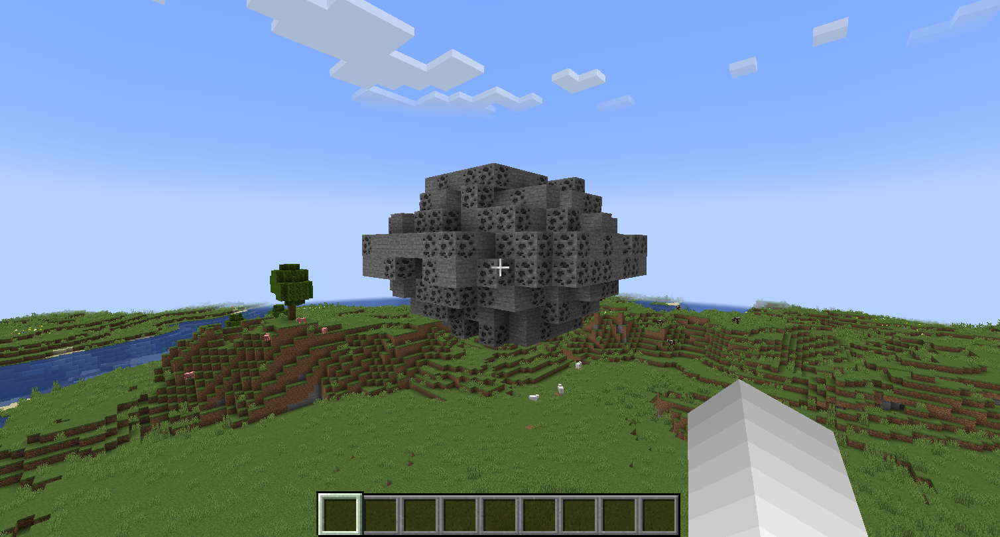

# HB’s Ore Clusters and Regen

## Short Overview

**HB’s Ore Clusters and Regen** is a mod that spawns large clusters of ore in the world in addition to the small vanilla ore veins players are used to. These ore clusters also regenerate (configurable) after several days so the clusters can be harvested again, boosting resource supply and incentivizing the player to set up multiple small bases around the world, and interconnect them.

## Why would you want this?

<ul>
  <li>Finding a large "cluster" of ore is a rewarding discovery that makes exploring caves more fun</li>
  <li>If you think Gregtech Ore Generation style is cool and you also don’t want to lose the traditional vanilla ore veins</li>
  <li>Regenerating clusters incentivize players to create a true secondary mining base, and makes choosing the location of a base more important</li>
</ul>

## Which ores regenerate? How big are the clusters? What if I like normal Minecraft mining?

- This mod does not modify the existing vanilla ore generation at all—it finds an existing ore vein and creates a cluster out of it.
- Vanilla mining is great and should remain a core part of the game!
- All aspects of the clusters are configurable via a JSON config file. See the section below or view my GitHub page.
- In its base configuration:
  - Coal and iron generate in large clusters between `12x12x12` and `16x16x16`
  - Deepslate diamond ore also spawns in smaller clusters deeper underground, and is more rare than coal and iron

## Compatibility with other mods

- This mod works with **Terralith**, **Tectonic**, **Biomes O’ Plenty**, and all world generation mods
- It can form clusters for **any block** naturally generated in the world (including modded ores, beehives, spawner blocks, etc.)
- The mod can add new ores to world gen — BUT the mod MUST be able to find a block of the specified in the world in order to know where to spawn the cluster. For example: you could create an iron_ore cluster, and add custom_mod:custom_nickel as one of the replaceableEmptyBlocks of the cluster.


## Configuration

The .toml file configures general settings for the mod and allows you to set DEFAULT parameters for the clusters. However, to configure individual clusters, you will need to specify the JSON configuration in a seperate file. See the configs/ folder above for samples.

```json
{
    "oreClusterConfigs": [				//wrapper array, all ore config objects {} must be with in this array
	{
            "oreClusterType": "minecraft:iron_ore",	//minecraft registry name for the block that the mod will search for and create a cluster around in the world
            "oreClusterSpawnRate": 1000,			//spawn rate in terms of number of chunks per 1000 chunks this cluster will spawn in e.g. 33/1000 chunks - choose low numbers here
            "oreClusterDimensionId": "minecraft:the_nether", //specifies the dimension the cluster will spawn in
            "oreClusterVolume": "10x10x10",			//rough volume the cluster will be contained within
            "oreClusterDensity": 0.5,				//specifies what percent of the area of this cluster will be filled with the oreClusterType above
            "oreClusterShape": "ANY",				// SPHERE or CUBE or ANY are your only options right now
            "oreClusterMaxYLevelSpawn": 256,	    // clusters will not spawn above this y level
            "oreClusterMinYLevelSpawn": 0,			  // clusters will not spawn below this y level
            "minChunksBetweenOreClusters": 0,			// spaces your clusters out
            "oreVeinModifier": 1.0,					// does nothing, at the momement
            "oreClusterNonReplaceableBlocks": "bedrock, air",	// specifies blocks that we DO NOT want the cluster replacing when it is built, put "air" here will make your cluster conform to the shape of the cave around it, but it will have less ore
            "oreClusterReplaceableEmptyBlocks": "",					// other blocks you want to spawn around your cluster - you could choose "stone" or "deepslate" or choose other ores use  "hbs_foundation:empty_block" to leave blocks unchanged
            "oreClusterDoesRegenerate": true						//specifies whether we want this cluster to regenerate each period
        }
  ]
    }
```
## Showcase

This section highlights sample ore clusters generated using custom configurations.

### Coal Ore Cluster
  
SPHERE shape, mixed with stone.

---

### Coal and Iron Clusters
  
Displays two cluster types of different shapes for coal and iron ores.

---

### Lapis Cluster Sample
  
A configured lapis cluster with other ores like redstone, emerald and diamond mixed in for variation.

---

### Naturally Spawning Lapis Underground
  
Cluster naturally spawned in the world

---

### Aether Ambrosium Cluster
  
Naturally spawned cluster of modded ore in a modded dimension

---

### Twilight Forest Ironwood Cluster
  
An eclectic cluster in the Twilight Forest containing ironwood saplings, time chests, timeslice doors, emeralds. Demonstrating the creativity this mod allows.


## Future Updates

Future updates will depend on feedback I receive on [my Discord](https://discord.gg/dp9d4wymNv). Between porting to other versions, adding features, and working on other mods, it's important I prioritize based on feedback from active users.

Planned features include:

- GUI for building ore cluster configurations
- Improved performance
- In-game block “Sacrificial Altar” to reduce regeneration time for clusters as a player progresses in their world
- Compatibility for modifying concentrations of existing ore veins
- Support for biome-specific configurations
- Support for multiple configurations for identical ore types


## Ore Clusters and Regeneration Mod Command Overview
All commands use the prefix: /hbOreClusters

## Table of Contents

- [1. Locate Clusters Command](#1-locate-clusters-command)
- [2. Get Config Command](#2-get-config-command)
- [3. Add Cluster Command](#3-add-cluster-command)
- [4. Trigger Regen Command](#4-trigger-regen-command)
- [5. Health Check Command](#5-health-check-command)


### 1. Locate Clusters Command
**Description:** Finds ore clusters near the player's position  
- finds the 5 nearest ore clusters to the player  
  - count can be raised or lowered  
  - blockType can be specified to search for a specific kind of cluster  
  - if no output was returned, you may need to load more chunks to find a cluster that has generated  

**Usage:**  
`/hbOreClusters locateClusters [count] [blockType]`

**Parameters:**  
`count` - (Optional) Number of clusters to find (default: 5)  
`blockType` - (Optional) Specific ore type to search for

**Examples:**
```
/hbOreClusters locateClusters
/hbOreClusters locateClusters 10
/hbOreClusters locateClusters minecraft:iron_ore
/hbOreClusters locateClusters 3 minecraft:diamond_ore
/hbOreClusters locateClusters 10 deepslate_diamond_ore
/hbOreClusters locateClusters 2 create:zinc_ore
```

**Expected Output:**
```
Found Clusters:
iron_ore at x:64 y:32 z:-128
iron_ore at x:128 y:45 z:-64
iron_ore at x:-32 y:28 z:96
```

---

### 2. Get Config Command
**Description:** Displays configuration information for the mod in general or a specific ore config  
- use with no arguments to get the configId for each type of configured cluster  
- also gives summary info about the period length and how far into the period the game is  
- with a configId provided, gives detailed info on the ore's config  

**Usage:**  
`/hbOreClusters config [configId]`

**Parameters:**  
`configId` - (Optional) Specific configuration ID to view

**Examples:**
```
/hbOreClusters config
/hbOreClusters config 0001
```

**Expected Output:**
```
Configured ores:
Ore With ConfigId: 0001:
  clusterType: minecraft:iron_ore
  clusterSpawnRate: 0.75
  clusterRegenerates: yes
Ore With ConfigId: 0002:
  clusterType: minecraft:deepslate_diamond_ore
  clusterSpawnRate: 0.75
  clusterRegenerates: yes
```

---

### 3. Add Cluster Command
**Description:** Manually adds an ore cluster at specified coordinates  

**Usage:**  
`/hbOreClusters addCluster <clusterConfigId> <x> <y> <z>`

**Parameters:**  
`clusterConfigId` - Configuration ID for the cluster type  
`x, y, z` - Coordinates for cluster placement

**Example:**
```
/hbOreClusters addCluster 0001 100 32 -50
```

**Expected Output:**
```
Successfully added cluster
```

---

### 4. Trigger Regen Command
**Description:** Triggers regeneration of ore clusters  
- USES CHUNK COORDINATES, NOT BLOCK COORDINATES  
- triggers a global regeneration sequence for all clusters in the world  
- if a chunkId is provided, triggers regeneration only for ores in that chunk  
- If this command does not work correctly for you then:  
  1. the source of the cluster may be in an adjacent chunk or  
  2. this cluster type may be configured to regenerate, check config  

**Usage:**  
`/hbOreClusters triggerRegen [chunkX chunkZ]`

**Parameters:**  
`chunkX, chunkZ` - (Optional) Specific chunk coordinates for targeted regeneration

**Examples:**
```
/hbOreClusters triggerRegen
/hbOreClusters triggerRegen 8 -4
```

**Expected Output:**
```
Global regeneration triggered
```
or
```
Regeneration triggered for chunk: 8:-4
```

---

### 5. Health Check Command
**Description:** Displays system health statistics  
- Posts daily in your minecraft server to determine if the code may be taking up too much processing power or ram  

**Usage:**  
`/hbOreClusters healthCheck [dimensionId]`

**Parameters:**  
`dimensionId` - (Optional) Specific dimension to check

**Examples:**
```
/hbOreClusters healthCheck
/hbOreClusters healthCheck minecraft:overworld
```

**Expected Output:**
```
Health Check Results:
Statistics for dimension minecraft:overworld:
{
  "queueSizes": {
    "pendingHandling": 0,
    "pendingDeterminations": 2,
    "pendingCleaning": 0
  },
  "averageThreadTimes": {
    "determination": 45.2,
    "generation": 128.7
  },
  "chunkTracking": {
    "determinedChunks": 156,
    "loadedOreClusterChunks": 24
  }
}
```

